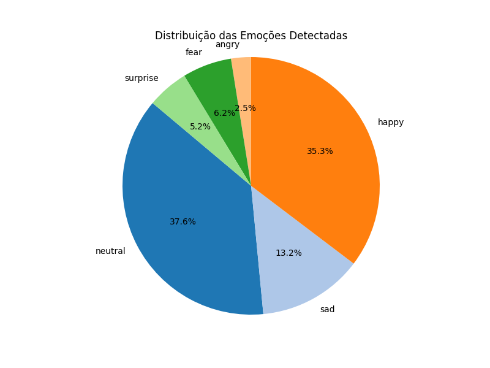

# 🧠 Projeto: Detecção de Emoções e Atividades em Vídeo

Este projeto realiza a **análise automática de emoções faciais e atividades físicas** (como braços levantados) em vídeos, utilizando:

- [DeepFace](https://github.com/serengil/deepface) para reconhecimento de emoções faciais
- [MediaPipe](https://mediapipe.dev/) para detecção de pose e face mesh
- Geração de **vídeo anotado**, **relatório textual** e **gráfico de pizza** com a distribuição emocional
- Detecção de **caretas/anomalias** com sequência mínima configurável

## 📂 Estrutura de Saída

- `video_anotado.mp4`: vídeo com as emoções e atividades anotadas
- `relatorio.txt`: relatório com eventos, anomalias e estatísticas
- `grafico_emocoes.png`: gráfico com a distribuição de emoções detectadas

## 🚀 Como Executar

### 1. Entre na pasta do projeto

```bash
cd nome-do-repo
```

### 2. Crie um ambiente virtual (opcional, mas recomendado)

```bash
python -m venv venv
source venv/bin/activate  # ou venv\Scripts\activate no Windows
```

### 3. Instale as dependências

```bash
pip install -r requirements.txt
```

Ou instale manualmente:

```bash
pip install opencv-python mediapipe deepface matplotlib numpy
```

### 4. Adicione seu vídeo

Coloque o vídeo que deseja analisar na raiz do projeto e atualize o nome no código:

```python
video_path = "nome_do_seu_video.mp4"
```

### 5. Execute o script principal

```bash
python analise_video.py
```

## ⚙️ Parâmetros que você pode ajustar

- `expression_threshold`: número mínimo de frames consecutivos com emoção negativa para ser considerada uma "careta"
- `fps`: utilizado para converter frames em tempo estimado (automático a partir do vídeo)

## 📊 Emoções detectadas

O DeepFace identifica as seguintes emoções:

- `angry`
- `disgust`
- `fear`
- `happy`
- `sad`
- `surprise`
- `neutral`

As emoções negativas (`angry`, `disgust`, `fear`, `surprise`) são usadas para detectar caretas.

## 🧪 Exemplo de saída no relatório

```
Atividades detectadas:
 - Braços levantados (frame 204, tempo 00:06)

Distribuição das emoções detectadas:
 - happy: 43.5%
 - neutral: 30.2%
 - sad: 15.8%
 - angry: 10.5%

Anomalias detectadas:
 - Careta detectada dos frames 380 a 389 (de 00:12 até 00:12)
```

## 🖼️ Exemplo do gráfico de emoções



## ✅ Requisitos

- Python 3.7+
- OpenCV
- MediaPipe
- DeepFace
- matplotlib
- numpy